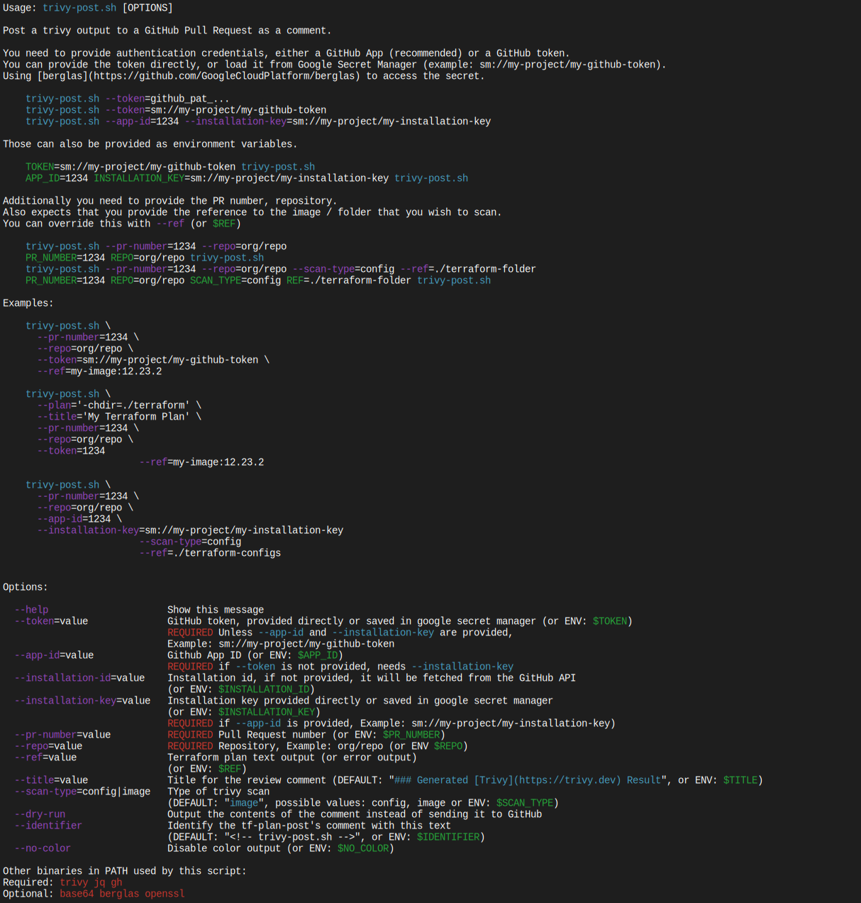

# Terraform Plan Post

A dockerized bash script that posts trivy output to a GitHub Pull Request as a comment.
Suitable for use in Google Cloud Build.

## Usage

```yaml
steps:
  - id: Run
    name: hashicorp/terraform:1.8.2
    script: |
      set -ex
      docker build -t my-image:$REVISION_ID .
      docker push my-image:$REVISION_ID

  - id: Post
    name: ghcr.io/ivank/trivy-post:1.0.0
    env:
      - APP_ID=123
      - INSTALLATION_KEY=sm://my-project/my-installation-key
      - REPO=$REPO_FULL_NAME
      - PR_NUMBER=$_PR_NUMBER
```

### Secrets

The script uses [berglas](https://github.com/GoogleCloudPlatform/berglas) to be able to load secrets from google secret manager directly. Secrets that start with "sm://" are piped through berglas.

```console
--token=sm://my-project/my-secret-name
# or
TOKEN=sm://my-project/my-secret-name
```

But if you don't use it you can just directly provide the secret value too.(or specify the corresponding environment variables).

```console
--token=$GH_TOKEN
# or
TOKEN=$GH_TOKEN
```

## Documentation

You can run `./trivy-plan.sh --help` to get the usage docs:



## Development

To run the tests you need [shunit2](https://github.com/kward/shunit2) installed.

```console
brew install shunit2
```

Running the tests

```console
test/trivy-post.test.sh
```

To rebuild the docs/help.svg file you will need [ansisvg](https://github.com/wader/ansisvg)

```console
./trivy-post.sh --help | ansisvg --colorscheme 'Apple System Colors' --charboxsize 9x16 --marginsize=4x4 > docs/help.svg
```

## Deployment

Github Releases deploys a new version to github packages
